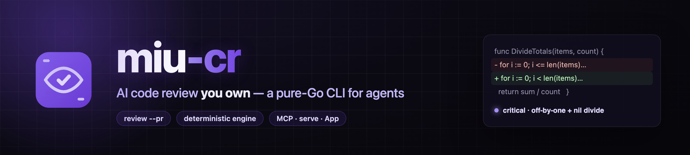

<p align="center"></p>

<p align="center">
  <a href="https://github.com/vanducng/miu-cr/releases"></a>
  <a href="https://go.dev"></a>
  <a href="LICENSE"></a>
</p>

# miu-cr

AI code review for the CLI, CI, and MCP hosts. Review staged changes locally, gate PRs in CI, or drive the engine from any MCP-capable agent (Claude Code, Codex, and others). Deterministic engine + LLM, stable JSON envelope on stdout.

**Docs:** [cr.miu.sh](https://cr.miu.sh)

## Install

```sh
# macOS / Linux — detects OS/arch, verifies checksum:
curl -fsSL https://cr.miu.sh/install.sh | sh

# Homebrew:
brew install vanducng/tap/miucr

# From source (Go 1.25+):
go install github.com/vanducng/miu-cr/cmd/miucr@latest
```

Windows: download `miucr_windows_x86_64.zip` from [Releases](https://github.com/vanducng/miu-cr/releases).

## Quickstart

No API key? Use your ChatGPT plan:

```sh
miucr login --provider openai   # browser login, caches a token
miucr review --staged
```

Bring your own key:

```sh
export ANTHROPIC_API_KEY=...    # or OPENAI_API_KEY
miucr review --staged           # review staged changes
miucr review --from main --to HEAD --gate high   # range; exit 2 on high+ finding
miucr review --pr owner/repo#123 --post          # GitHub PR with inline comments
```

Full guide: [Getting started](https://cr.miu.sh/onboarding/)

## Features

- **Local review** — staged changes, commit range, or a single commit
- **GitHub PR review** — inline comments, one upserted summary, head-SHA anchoring, fork-safe
- **CI / GitHub Action** — drop-in reusable action; see [`examples/workflows/`](examples/workflows/)
- **Project rules** — `.miu/cr/rules/*.md` glob-scoped context injected per file
- **Evaluation** — `miucr eval` compares reviewer commands against expected findings
- **MCP server** — `miucr mcp` exposes `review_run` / `review_get` over stdio

Full reference: [cr.miu.sh](https://cr.miu.sh)

## Develop

```sh
go build ./cmd/miucr   # single static binary (CGO_ENABLED=0)
go test ./...          # table tests + fakes, no live network or LLM
```

**Agent skill:** [`.agents/skills/miucr/SKILL.md`](.agents/skills/miucr/SKILL.md) — agent-agnostic; `.claude/skills/miucr` is a symlink to it.

## License

Apache-2.0. See [LICENSE](LICENSE).
