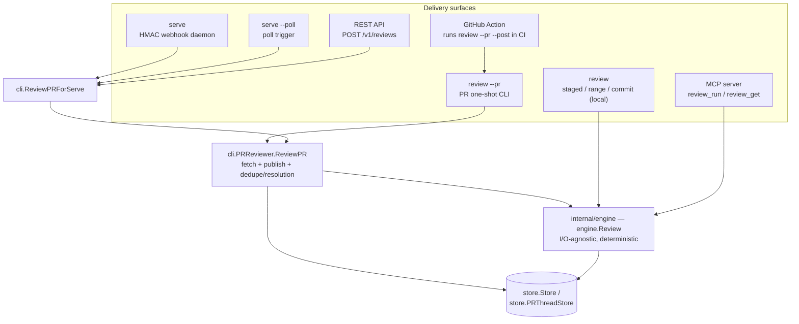
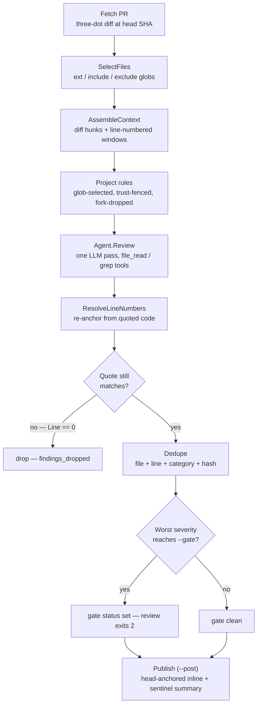
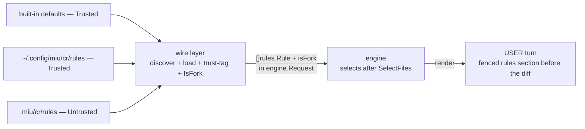
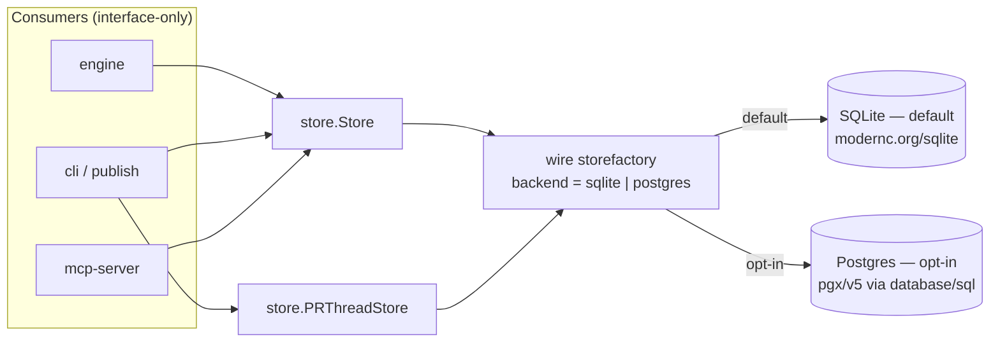
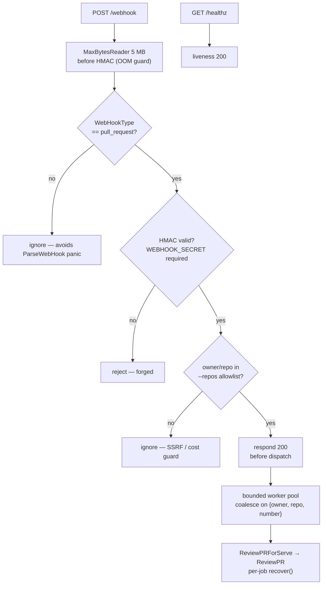
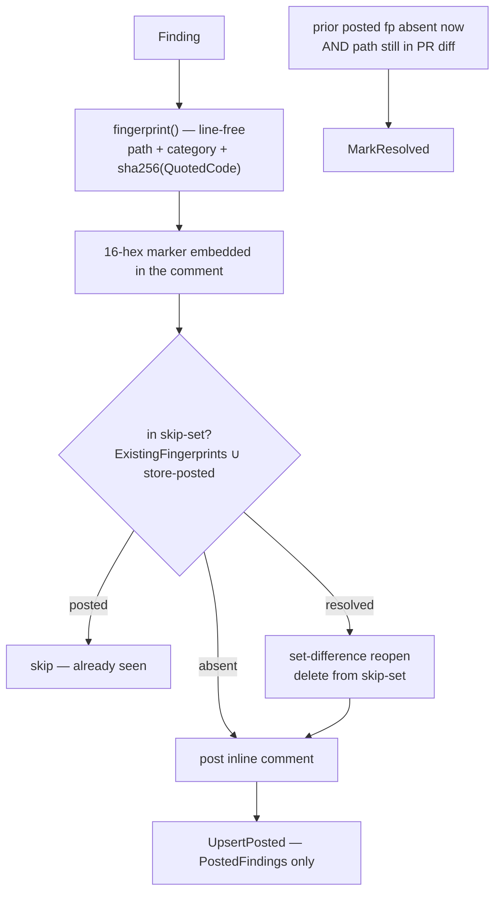
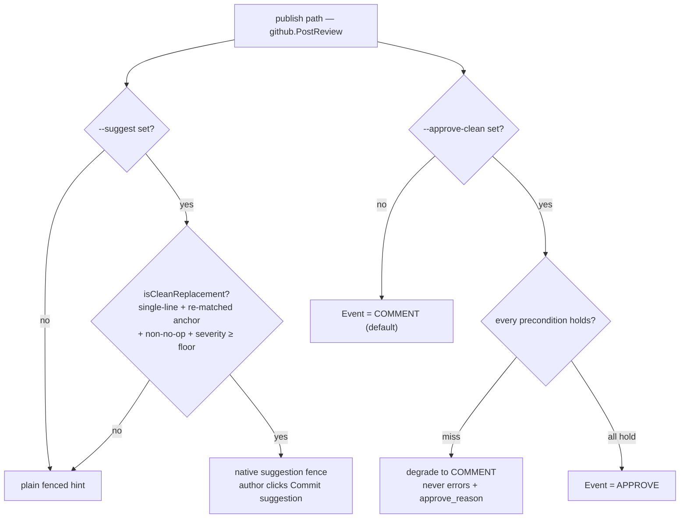
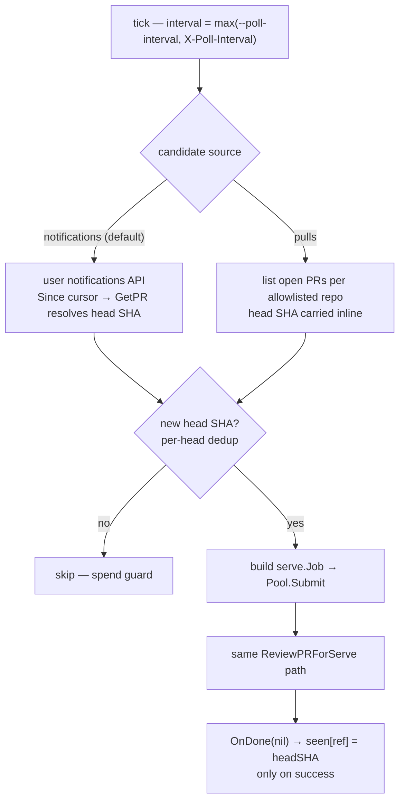
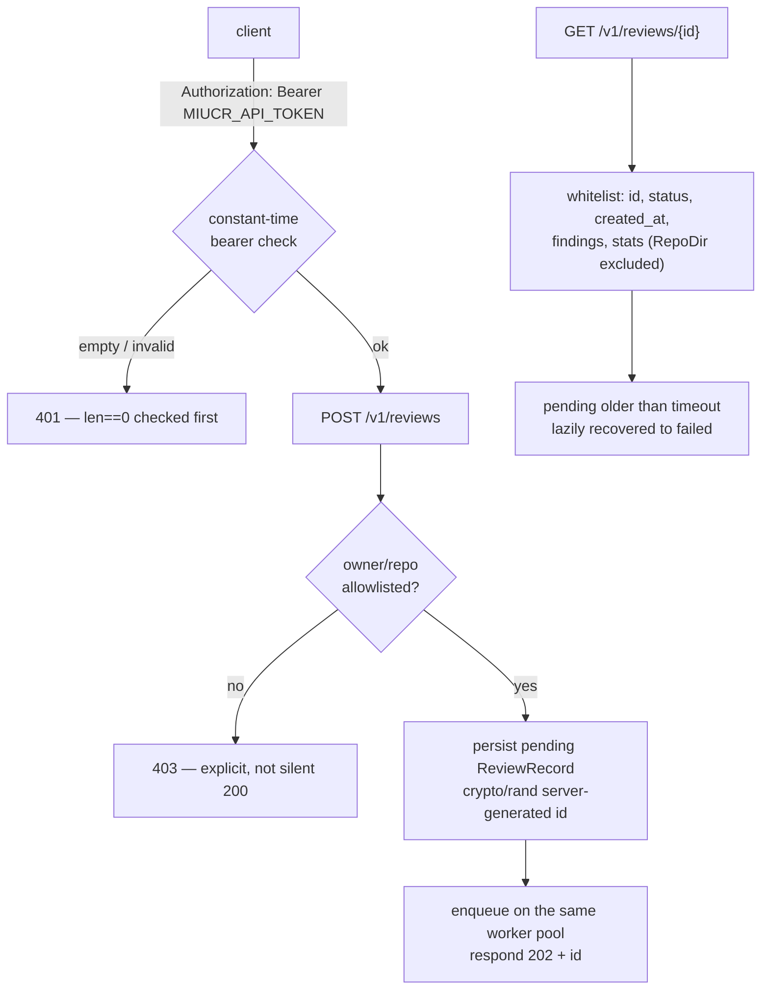
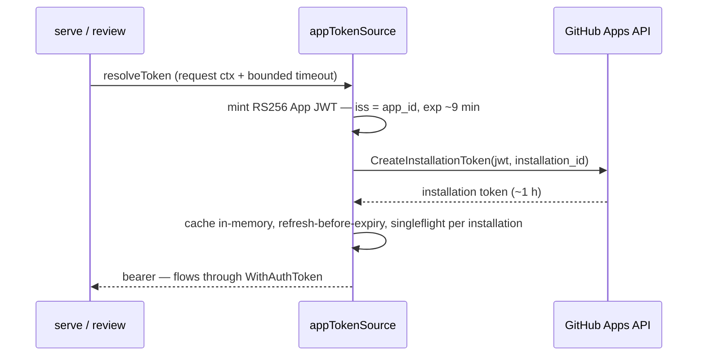

miucr is a pure-Go (`CGO_ENABLED=0`) static binary. The review engine is **owned
and deterministic** where correctness matters — selecting files, assembling
context, anchoring findings to real line numbers, gating, and dedupe. The LLM is
used **only for judgment**: finding bugs and proposing fixes. Every delivery
surface is a thin shell around that one engine.

## System overview

miucr exposes several surfaces — a one-shot `review` CLI, the `serve` webhook
daemon, a GitHub Action, a poll trigger, a REST API, and an MCP server — but
there is **no second engine and no duplicated review logic**. The
GitHub-integrated surfaces all converge on a single PR-review path,
`cli.PRReviewer.ReviewPR`; local review (`miucr review` over staged changes / a
ref range / a commit) and the MCP `review_run` tool call the shared
`engine.Review` directly. Persistence is reached only through two interfaces.

### Import-layering invariant

`cli` stays **below** `engine` / `agent` / `github` in the import graph. The
engine-backed and GitHub-backed implementations are injected at startup via
`internal/cli/wire` (blank-imported by `cmd/miucr`), so `cli` never imports the
heavy packages directly. `internal/serve` sits beside `cli` and depends only on
`cli` (the review seam) + `config` (redaction) + stdlib + go-github webhook
helpers; `internal/engine` is never touched by `serve`. This inversion is what
keeps every surface a thin shell: a surface wires the seam, it never re-implements
review.

`ReviewPRForServe` delegates straight to `PRReviewer.ReviewPR`; it bypasses the
CLI's `gate_failed` exit path, so the serve gate is **publish-severity only** and
never affects daemon liveness. The GitHub Action is a composite action that
installs the released binary and runs `miucr review --pr --post` in CI — it
validates the released binary, not `serve`.

## The PR-review data flow

There is one pipeline. Each stage is deterministic except the single LLM pass:

The reviewed *revision* travels with the diff, so every later stage reads the exact
content the diff came from. **Line-anchoring with drift-reject** is the core trick:
any line number the model emits is discarded; the engine recomputes each finding's
line from its quoted `existing_code` against the reviewed revision — matching the
hunk new side, then old side, then the full new-file content as a fallback. A
finding whose quote no longer matches resolves to line `0` and is **dropped**. That
single rule kills the position drift that plagues diff-only and bare-agent review.
Surviving findings are de-duplicated on `file + line + category` plus a short hash
of `rationale + suggested_patch`, then the gate ranks severities
(`info < low < medium < high < critical`); an unrecognized gate fails loudly so a
misconfigured run never silently passes.

Publishing is head-SHA-anchored inline comments plus **one idempotent sentinel
summary**. See [How it works](/how-it-works/) for the per-stage detail.

### Project-rules injection seam

Markdown [project rules](/rules/) feed deterministic context into the reviewer
without ever gating. `internal/rules` is self-contained (frontmatter parse +
layered load + glob selection + context-file inliner) and sits **below** the
engine; it does no review logic. The seam splits cleanly across the layering:

Only the wire layer knows whether a path is a local working tree or a fork-PR temp
clone, so it owns discovery, provenance (defaults/user = **Trusted**, repo =
**Untrusted**), and `IsFork` — it never selects. The engine selects in-memory (no
filesystem access) from the slice wire passed in, because selection needs the
changed paths that only exist after `SelectFiles`. Repo (Untrusted) rules are
wrapped in a context-only fence and **dropped entirely on fork PRs** before
selection; the finding-JSON contract stays in the cached `systemPrompt`, so
injected rule prose can never redefine the schema. Rules get their own token cap
(subtracted from the diff budget with a floor so the diff budget never hits the
disabled sentinel), and `stats.rules_applied` / `rules_truncated` report the
result.

## The store-swap seam

miucr persists reviews and PR-thread resolution state behind two small
interfaces. Everything above them — engine, CLI, publish, MCP server — consumes
only the interfaces, so the backend swaps without any of them changing.

The backend factory lives in the **wire layer** (`storefactory`), not in
`package store` — both `sqlite` and `postgres` import `store`, so a factory inside
`store` would cycle. Resolution is `MIUCR_STORE_BACKEND` (env) > `[store] backend`
(config) > `sqlite`, with an empty config value falling through to the default. The
Postgres DSN prefers `MIUCR_PG_DSN` (env) over `[store] dsn` so the password need
not live in plaintext; it is never persisted, never in the envelope, and always
redacted (`config.RedactString`) in every error and log.

The Postgres backend uses **pgx/v5 via its `database/sql` adapter**
(`sql.Open("pgx", dsn)`), reusing the SQLite package's `*sql.DB`/`Tx` shape so the
round-trip code and tests stay backend-symmetric. pgx is pure-Go, so the
`CGO_ENABLED=0` static-binary invariant holds alongside `modernc.org/sqlite`. The
SQL mirrors SQLite 1:1 (`?` → `$N`, `ON CONFLICT … excluded` → `EXCLUDED`); time
stays `RFC3339Nano` TEXT for byte-parity. A **schema-parity test asserts both
backends define the same tables and columns** (types modulo dialect), and a shared
backend-conformance suite runs SQLite always and **real Postgres in CI** via a
service container.

Because Postgres is an explicit choice, an open/connect/auth failure with
`backend = postgres` is **fatal** (a typed `store.unavailable` `CLIError`, exit 1,
safe to retry) on both the CLI and the MCP-`Serve` paths — never a panic, never a
silent nil-degrade. The implicit, opt-in SQLite PR-thread path keeps its silent
nil-degrade. See [Store backends](/store-backends/) for the operator reference.

## The serve security model

`serve` is a network daemon, so the guards are mandatory and ordered. The request
is cheap-rejected as early as possible, GitHub is acknowledged inside its ~10 s
budget, and only then is the review dispatched to a bounded worker.

`WEBHOOK_SECRET` is **required at startup** (an empty secret would accept forged
webhooks) and a GitHub token is required to clone and post. The 5 MB body cap runs
**before** HMAC validation; the `pull_request` event-type check runs **before**
`ParseWebHook` (which panics on unregistered event types); the `200` is returned
**before** dispatch. A mutex-guarded in-flight set keyed by `{owner, repo, number}`
coalesces concurrent deliveries for the same PR, and a full queue is loud-logged
and counted — never a silent drop. The owner/repo **allowlist** (`--repos`) stops
a forged webhook from making the token clone an arbitrary repo. All serve-side
errors route through `config.RedactString` (the clone URL embeds the token), so
secrets are never logged, never in the envelope, never persisted.

## Cross-push dedupe and resolution

Re-running a review must not re-post a finding the author already saw — even across
pushes that shift line numbers — and a finding the author **fixed** should go quiet
without being permanently suppressed if it recurs. Two independent layers handle
this.

**Layer 1 — content-stable fingerprint (portable, no DB).** The single chokepoint
`github.fingerprint()` is line-free: `path | category |
sha256(normalizeForFingerprint(QuotedCode))`. Dropping `Line` (the volatile re-post
axis) and `Rationale` (LLM free-text) makes a re-anchored finding hash to the same
16-hex marker, so the existing comment markers carry the dedupe state with **no
database** — this is exactly the stateless, DB-free path the ephemeral Action
runner needs. `normalizeForFingerprint` is a dedicated, **less-lossy** normalize
(strip the diff marker + trailing whitespace, CRLF → LF; **preserve leading
indentation and blank lines**) — deliberately not the anchor's full-trim normalize,
which would over-dedup and collapse indentation-distinct findings. The content key
is best-effort exact-match; semantic matching is a separate, opt-in layer (see
[Semantic code-recall](/semantic-recall/)).

**Layer 2 — opt-in PR-thread store (serve / local).** Resolution tracking lives
behind `store.PRThreadStore` — `UpsertPosted` / `MarkResolved` / `ListFindings`
over a `pr_findings` table (`owner, repo, number, fingerprint, path, status` with
`status ∈ {posted, resolved}`). It is **opt-in via `MIUCR_PR_STORE`** (an explicit
signal, not a dir-exists heuristic) so a warm-home self-hosted runner never
silently persists finding text, and it returns **nil on the Action/CI path**.
Finding text is stored locally only under `~/.config/miu/cr`; it never reaches the
envelope.

The wire glue (`publishReview`) computes the skip-set as `ExistingFingerprints ∪
store{posted}`, then **reopens via set difference**: for each current finding whose
stored status is `resolved`, it deletes the fingerprint from the skip-set — the
lingering GitHub marker keeps it in `ExistingFingerprints`, so a plain union could
never re-raise it; it must be subtracted. After the review, the store is populated
from the **actually-submitted** set (`PostedFindings` — post-cap, post-empty-guard,
post-degrade), never the raw findings, so a cap-omitted finding never records
`status=posted`. A prior `posted` fingerprint absent from the current run whose path
is **still in the PR diff** → `MarkResolved`. The store handle is opened per review
inside `ReviewPR` and closed on return, so `serve` opens one short-lived handle per
PR event, not a long-lived one. Integrity under concurrency rests on **WAL +
`busy_timeout` + idempotent `ON CONFLICT` upsert**, not a per-process lock. This is
best-effort against duplicate *comments*, not a hard guarantee: the stateless marker
scrape converges once the first review's comments land.

## The write-action safety model

`review --pr` has two **opt-in** write-actions, **both default OFF**, both gated on
the same publish path (`github.PostReview`, driven by a `PostReviewOptions` struct).
Without the flags, behavior is unchanged — except a latent bug is fixed:
`commentBody` no longer emits a one-click `suggestion` fence unconditionally; a
native suggestion is emitted only under the gate below, else a plain fenced hint.

**`--suggest`** emits a GitHub native single-line suggested change only when *all*
hold (`isCleanReplacement`): the finding is **single-line**
(`EndLine == 0 || EndLine == Line` — a wrong multi-line range 422s the whole
review); `SuggestedPatch` is a single non-empty line; the raw new-file line at
`Line` exists and `normalizeLine(rawLine) == normalizeLine(QuotedCode)` (proving
`Line` is the anchored line, since the resolver can fall back to an old-file
number); the patch is not a no-op; and severity is ≥ the floor (default `medium`).
Anything else degrades to the safe plain hint. Suggestions are **author-applied** —
miucr never pushes or commits to the PR branch.

**`--approve-clean`** submits `Event=APPROVE` instead of the default `COMMENT` only
when **every** precondition holds: gate clean, **not a fork**, **trusted author**
(`AuthorAssociation` ∉ `{NONE, FIRST_TIME_CONTRIBUTOR, FIRST_TIMER}`), **≥1 file
actually reviewed**, **head unchanged** (the head SHA is re-fetched immediately
before `CreateReview`), and **not already approved** at the current head SHA. A
self-approve 422 is caught reactively and degrades to `COMMENT`. A precondition miss
**degrades to COMMENT, never errors** — a CI run is never failed by an
approve-precondition. Outcomes surface in the `data.pr` envelope block
(`approve_action`, `approve_reason`, `suggestions_posted`).

`serve` inherits both flags **OFF** — a webhook daemon must not auto-suggest or
auto-approve — and the **GitHub Action stays comment-only** (a default token APPROVE
is a self-approve / supply-chain risk). One caveat: a PAT-submitted APPROVE
**satisfies branch-protection required reviews** and can enable auto-merge, so "the
human still owns merge" is not an invariant of `--approve-clean`; use a bot identity
distinct from the author (GitHub Apps are self-approval-safe by construction), or
leave it OFF.

## The poll-mode trigger

For environments that cannot receive a webhook, `serve --poll` adds a poll-mode
**trigger** beside the webhook receiver. It is trigger-only: it builds the
**identical** `serve.Job` the webhook builds and calls the same `Pool.Submit`, so
the review/publish engine and fork handling are inherited unchanged via
`ReviewPRForServe`. Webhook stays the default; poll is opt-in.

The per-head dedup is the spend guard — **each new head SHA is one full LLM
review**, and a re-pushed head is a new SHA → one fresh review; the `--repos`
allowlist is the blast-radius guard. Poll uses a narrow serve-local `notifGetter`
interface (`ListNotifications` / `ListOpenPRs` / `GetPR`) rather than widening the
shared `github.Client` (which would break its fakes). A restart-safe poller-local
cursor (`~/.config/miu/cr/poll-cursor.json`, `{since, seen, notif_seen}`) records
the reviewed head — **not** the review store, which can't answer "reviewed at head
SHA X". The token is never a field; the file is written atomically (`0600`); a
corrupt file degrades to empty + warn, never fatal. The poller records
`seen[ref]=headSHA` only via `Job.OnDone(nil)` on success, so a failed or dropped
review stays retryable next tick. Rate limits are honored (`X-Poll-Interval` floor,
`RateLimitError` sleeps to reset, transients exponential-backoff with jitter), and
on any error the cursor is never advanced — no tight loop. Webhook and poll run
under one `errgroup`/ctx and drain exactly once on cancel.

## REST API and GitHub App auth

`serve` can run as a **deployable single-operator service**. Both halves are
opt-in; the default token + webhook + poll path is unchanged.

The REST API is gated by **one shared bearer = one trust boundary**: whoever holds
`MIUCR_API_TOKEN` owns every stored review. This is deliberately **not**
multi-tenant. The bearer middleware checks `len(token)==0 → 401` **before**
`subtle.ConstantTimeCompare` (empty compares equal to empty), and the token is
**env-only** (no flag → no `argv`/`ps` leak) — with no token the `/v1` routes are
not registered. POST validates and allowlist-checks (an explicit **403** off the
allowlist, unlike the webhook's silent ignore), generates a `crypto/rand` id (a
client can never supply one — removing the forgeable-id IDOR class), persists a
`pending` record, enqueues onto the **same worker pool** the webhook uses, and
returns **202 + id**. The store gains an `UpsertReview`
(`INSERT … ON CONFLICT(id) DO UPDATE`) so the worker can persist the final record
over the pending row. `GET` maps a **whitelist** to the envelope, excluding
`RepoDir` (the host `/tmp` clone path — info disclosure), and a `pending` row older
than the review timeout is lazily recovered to `failed` so a crashed worker leaves
no eternal pending.

GitHub App auth is the second opt-in half:

A pure-Go **RS256** App-JWT minter (`crypto/rsa` + `crypto/sha256` + `crypto/x509`
+ base64 RawURL, **no new module**) back-dates `iat` ~60 s and sets `exp` < 10 min,
with `iss = app_id`. A `TokenSource` interface keeps the seam clean:
`staticTokenSource` reproduces the prior PAT/anonymous behavior byte-for-byte;
`appTokenSource` mints the JWT, exchanges it via `Apps.CreateInstallationToken`,
and caches the installation token in-memory with **refresh-before-expiry** (~5 min
margin) plus **single-flight** (keyed by installation id — no thundering herd). An
installation token is just a bearer, so it flows through the existing
`WithAuthToken` — `NewClient` and `resolveToken`'s signature are untouched. The
`[github]` config gains `mode = pat [default] | app`, `app_id`, `installation_id`,
and `private_key_path` (**path-only** — the PEM is read at startup, parsed, and its
raw bytes zeroed; never inlined, logged, or persisted, since `RedactString` can't
mask a multi-line PEM).

See [REST API & GitHub App auth](/rest-api-and-github-app/) for the operator-facing
reference and the single-operator threat model.
